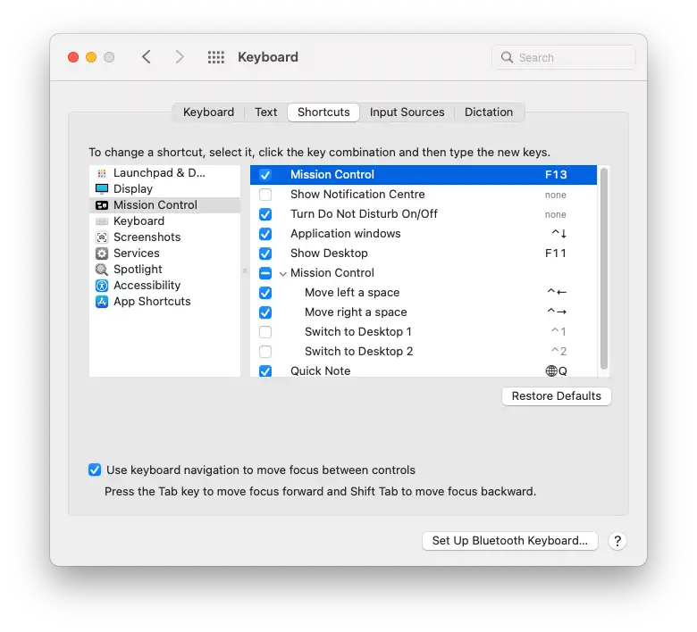
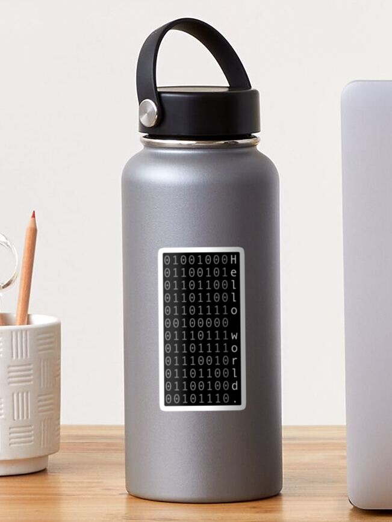

This [banana keyboard](https://www.etsy.com/au/listing/1232068534/8-key-banana-macropad) project is bit of a joke keyboard which started when someone shared a link to some novelty keyboards / macro pads in an [Etsy Store](https://www.etsy.com/au/shop/Steboards).

The banana keyboard arrived a few weeks after I ordered it and looked great. The eight keys were mapped to the `F13` - `F20` range. I could use the macOS Keyboard Shortcuts settings to map these keys to almost any individual action I might want.

> 

However the eighth key, mapped to `F20`, wasn't registering in macOS. This led me down a bit of a rabbit hole of searches. The primary takeaway being that macOS doesn't handle function keys above 19 the same way as the rest of the keyboard.

Not content with an unusable key on my banana, I messaged the seller on Etsy, who quickly replied with the source code they'd used to program the banana.

The `arduino` code was reasonably straight forward and didn't take much effort to make some changes. With the [Arduino Cloud Editor](https://create.arduino.cc) (and the companion firmware) I managed to reprogram my banana keyboard from the internet!

Referencing the [Arduino Keyboard library](https://www.arduino.cc/reference/en/language/functions/usb/keyboard/), the first goal I had was to remove the `F20` and replace it with something that would register in macOS. A bit of code refactor to group all the output keys together and I had something working ([banana.c](https://gist.github.com/pbrdmn/5a44e6726664d8411423e7133ea8912d)).

---

After playing around with the code, I first began looking at adjusting when keys sent the press event. By moving this from the initial *on* change to the *off* change, I could trigger different actions for short vs long presses (e.g. "tap" vs "hold") and by holding even longer, expire the event altogether.

```c
// handle button press for duration
if (duration < DEBOUNCE_TIME) {
  // ignore noise
} else if (duration < HOLD_TIME) {
  // handle tap
  Keyboard.write(taps[i]);
} else if (duration < TIMEOUT) {
  // handle hold
  Keyboard.write(holds[i]);
} else {
  // held too long
}
```

This allowed the eight key banana to reliably emit 16 different events. The full code for this is available at [hex_banana.c](https://gist.github.com/pbrdmn/ad6a53a064057658a2a4f19d895c0077).

---

Thinking about other opportunities for an eight key macro pad, I had the idea of using each of the eight keys to control individual character bits and allow the typing of ascii characters by inputting the binary values directly, treating the whole macro pad as a chorded keyboard, similar to a [stenotype](https://en.wikipedia.org/wiki/Stenotype) keyboard. I had been thinking about this recently and put together a ["Hello World." binary sticker](https://www.redbubble.com/i/sticker/Hello-world-binary-by-philip-boardman/134772669.EJUG5 "Sticker design with binary representation of each letter in the string 'Hello world.'").

The keyboard captures each of the keys being pressed and store this into an internal buffer. Once all the keys have been released, the recorded input is then processed and output as an ascii character.

Another quick rabbit hole, some bit setting functions and a relatively clean solution appeared for the [ascii_banana.c](https://gist.github.com/pbrdmn/646eedc374ec37e680a70c88dc4bfcc3) keyboard.

Not without fault and edge cases, and plenty of other opportunities for improvement, but flashing this code to the banana keyboard (again, from the internet!) and a few rounds of debugging 😅 and the banana began emitting characters!

Referencing an [ascii table](https://www.binaryhexconverter.com/binary-ascii-characters-table "Table listing ascii characters and their binary representation") (no, I didn't have these committed to memory), I hold down the keys corresponding to

> 01001000

and on the screen, the keyboard prints

> H

next I enter

> 01100101

and on the screen

> He

continuing with

> 01101100  
> 01101100  
> 01101111

and I have typed

> Hello

---

A bit more tinkering and a few rough edges, but a fun experiement into some different ideas.

The code for different banana keyboard functions:

- [banana.c](https://gist.github.com/pbrdmn/5a44e6726664d8411423e7133ea8912d)
- [hex_banana.c](https://gist.github.com/pbrdmn/ad6a53a064057658a2a4f19d895c0077)
- [ascii_banana.c](https://gist.github.com/pbrdmn/646eedc374ec37e680a70c88dc4bfcc3)

After contacting the seller on Etsy, this code has now been contributed to the public [SteBoards/BananaKeyboardCode repo on GitHub](https://github.com/SteBoards/BananaKeyboardCode) where others can use these as examples.

---

Order a [Hello World binary sticker](https://www.redbubble.com/i/sticker/Hello-world-binary-ascii-dark-mode-by-philip-boardman/134772927.EJUG5?asc=u) from my Redbubble store.

[](https://www.redbubble.com/i/sticker/Hello-world-binary-ascii-dark-mode-by-philip-boardman/134772927.EJUG5?asc=u)