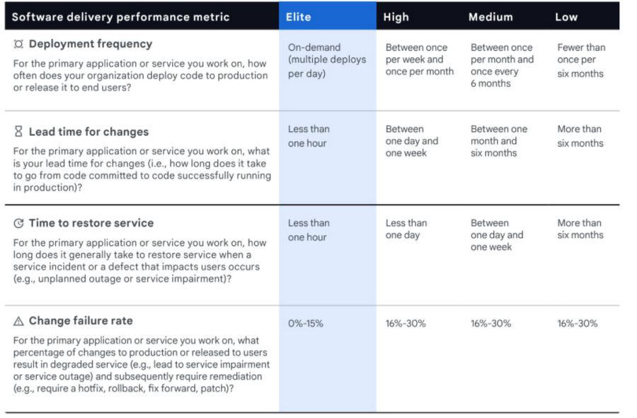

<abbr title="DevOps Research and Assessment team">DORA</abbr> stands for The DevOps Research and Assessment team. Within a seven-year program, this Google research group analyzed DevOps practices and capabilities and has been able to identify four key metrics to measure software development and delivery performance.

The health and performance of a product engineering team can be assessed using four key metrics.

## The Four DORA Metrics

1. Deployment Frequency
2. Lead Time for Changes
3. Mean Time to Recover
4. Change Failure Rate

## Deployment Frequency

> How often does your organization deploy code to production or release it to end-users?

Higher performing teams will generally deploy more often, with a standard being at least once per week.

- Elite: On-demand (multiple deployments per day)	
- High: Between once per day and once per week	
- Medium: Between once per week and once per month	
- Low: Between once per month and once every six months

## Lead Time for Changes

> How long does it take to go from code committed to code successfully running in production?

This metric indicates the velocity of software delivery, measuring the time between creating a commit and deploying this change to production.

- Elite: Less than one day
- High: Between one day and one week
- Medium: Between one week and one month
- Low: Between one month and six months

## Mean Time to Recover

> How long does it take to restore service when a service incident or a defect that impacts users occur?

Unplanned outages or incidents happen to even the highest performing team, tracking how much time it takes for a service to bounce back from failure demonstrates the team's ability to recover a system. Shorter recovery times build confidence.

- Elite: Less than an hour
- High: Less than one day
- Medium: Less than one week
- Low: Between one week and one month

## Change Failure Rate

> What percentage of changes to production or end-users results in degraded service?

<abbr title="Change Failure Rate">CFR</abbr> is a true measure of quality and stability of a team's delivery process and the resulting system.

- Elite: 0-15%
- High: 16-30%
- Medium: 31-45%
- Low: 46-60%

## Bonus: Reliability Metric

In 2021, the DORA team added a fifth metric — reliability — to the list of things that can impact organizational performance.

> Historically we have measured availability rather than reliability, but because availability is a specific focus of reliability engineering, we’ve expanded our measure to reliability so that availability, latency, performance, and scalability are more broadly represented.

## Summary Chart

> 

## References

- [THE DEFINITIVE GUIDE TO
DORA Metrics](https://www.leanix.net/en/wiki/vsm/dora-metrics)
- [Are you an Elite DevOps performer? Find out with the Four Keys Project](https://cloud.google.com/blog/products/devops-sre/using-the-four-keys-to-measure-your-devops-performance)
- [Announcing DORA 2021 Accelerate State of DevOps report | Google Cloud Blog](https://cloud.google.com/blog/products/devops-sre/announcing-dora-2021-accelerate-state-of-devops-report)
- [Photo by Mitchel Boot](https://unsplash.com/photos/hOf9BaYUN88?utm_source=unsplash&utm_medium=referral&utm_content=creditShareLink)  