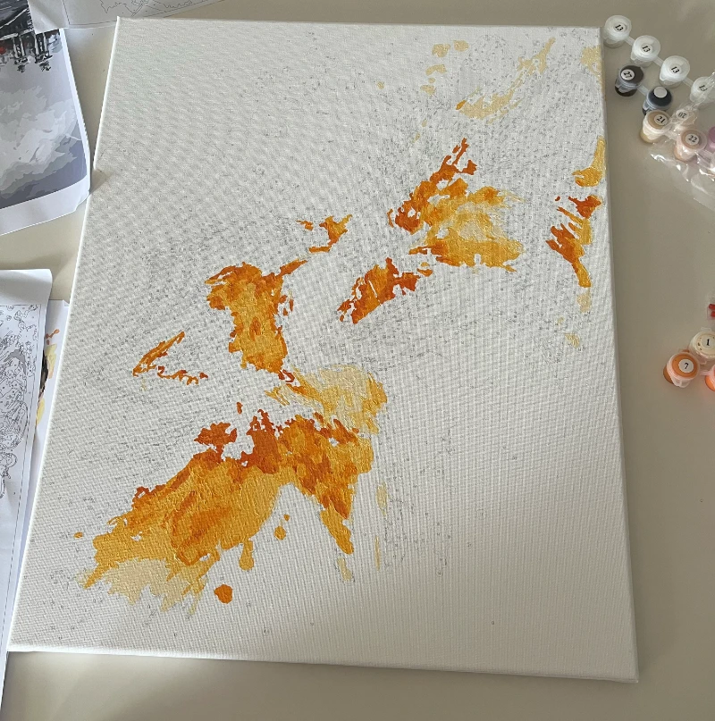
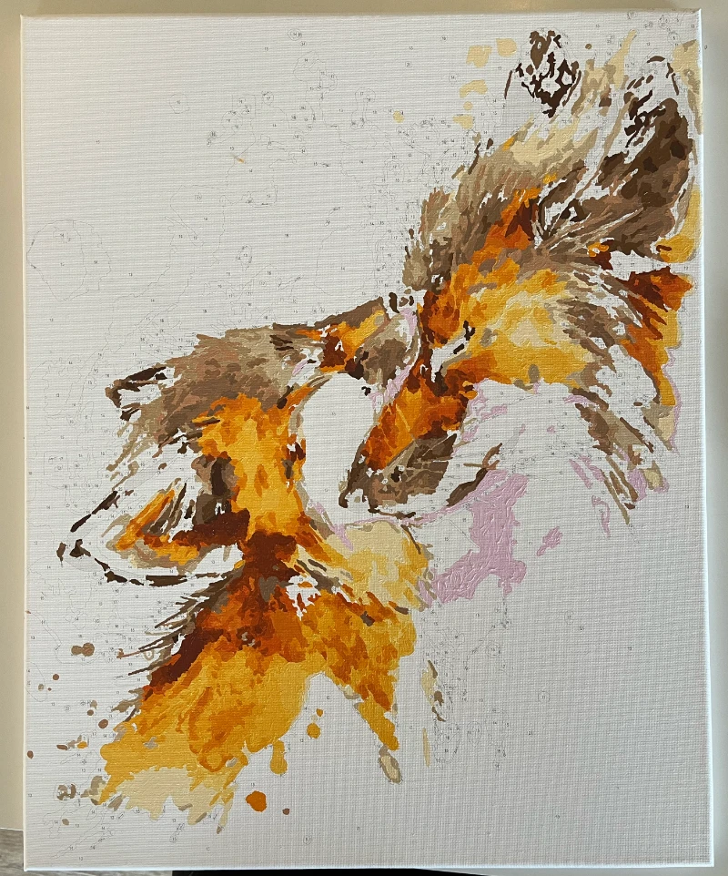
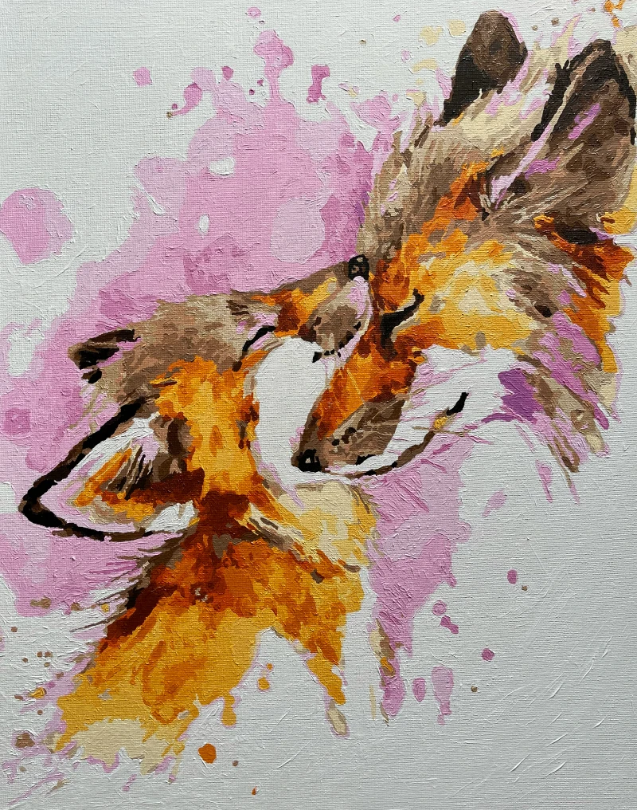

During my holidays, I usually enjoy spending a morning or an afternoon building a LEGO set. It is a relaxing time, with some quiet music, clear instructions and something to keep my hands busy.

This year, the children and I were each working on our LEGO sets around the dining table and my wife pulled out some paint by numbers kits to work on with us.

After completing my LEGO set, and James Bond sitting comfortably in his Aston Martin, I began working on one of the paint-by-numbers kits the children had openned by then abandoned due to the compexity and detail.

> A paint-by-numbers project is a type of painting that is pre-outlined with numbers corresponding to specific paint colors.

I began with the paint colour `#1` and started working my way through the colours. This project too much longer than my usual LEGO sets and several times I completely lost track of time "in the zone".

After completing my first painting session, several hours later, I had applied half a dozen colours to the canvas.

And it resembed some smudges, or a spilled cup of tea.

> 
>
> Canvas with orange blotches, coloured paints in containers

This was the first time doing this sort of project, though I had painted minature figures for tabletop games previously. My primary concern is that I was unsure how much paint to use. Too much paint and I'd run out, too little and the lines and numbers would show through, requiring more time and effort going back over those areas.

It wasn't until I'd begun adding the thirteenth colour (`#14`, I skipped the white `#13`) to the canvas that the foxes started really revealing themselves.

I had been given the canvas from the box without seeing that the result was going to be, so it was great to see the image taking shape, though there was still a lot of paint left to be applied to the canvas. And I was noticing more and more areas that I'd missed on my first run through with each of the numbered paints.

> 
>
> Brown paint is added to the previous orange blotches, and the forms are beginning to resembles a pair of foxes

After a dozen painting sessions over two weeks, the painting was nearing completion. More time was spent opening and closing paint and cleaning the brush between applying colours as I found and painted more areas that had been missed.

Some additional paint was also added to cover the areas which had be painted too thinly previously that the numbers or lines were showing through the paint.

> 
>
> The addition of pink paint is used to separate the foxes from the backgound an sets a warm tone to the painting

The final colour to be added was the five pots of `#13` white paint. And it was quite tiring painting a whole lot of nothing, ensuring that there was a reasonably even coating of paint and that it was applied thick enough to cover most hints of the lines and numbers below.

