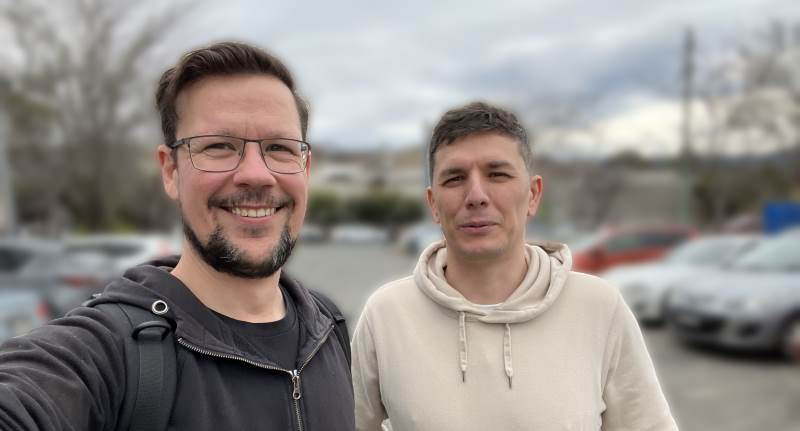
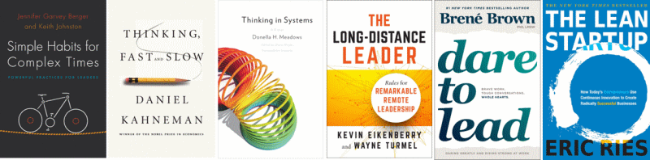

> A presentation outlining my career change into management, for [Web Directions Code Leaders](https://webdirections.org/leaders/) 2022.

## Continually learning

In the beginning of my career, I worked as a web developer for several small companies. There was often little thought put toward career development, mentorship, or any training beyond what was required to get the day-to-day work completed, though sometimes not even that.

I would learn new programming languages and tools on my own time that seemed interesting and would unlock the skills to build websites or applications in a new way.

To me, self-directed and independent learning appeared to be the industry norm. The people building the web were responsible for their own education, keeping their skills up to date, and knowing which tools would be relevant. Myself and those I knew would spend time outside of work for learning and development activities.

Without a clear path for development, people tended to learn technical skills—those that are commonly discussed and easy to demonstrate for job applications. But we might have been missing out on critical career development knowledge from structured learning pathways.

---

## Unstructured career

Like me, I imagine for many people a career in software development wasn’t started with a clear path mapped out to where you would end up.

You liked playing with computers, you got a programming book, took a course, or taught yourself to code by pulling apart websites in your free time - which was my experience.

This interest in computers, technology, and learning about programming after school continued as I studied computer engineering at university. Here I learned of Unix, microcontrollers, and many of the programming fundamentals, principles, and patterns I still use today.

I found the university courses in IT and software engineering taught me how to write code, how software works, and the basics of how to run a software project. But I found little there that would help build a career roadmap beyond what it meant to write software.

---

## Years of experience

With no structured development plan, fresh learning opportunities can be difficult to identify. Without a plan, you can spend several years repeating the same experience, doing the same work. You might get better at doing the work, but without being challenged, it is difficult to grow.

One question I wish I would have asked myself more deliberately through this time is, "What do I need to learn next?"

Without having an understanding of the career path, the opportunities I took were the ones that came to me. Some of these were excellent and enjoyable, like building and publishing iPhone apps for a cycling magazine. Some were more tedious, like rebuilding a cycling classified ads site or implementing an in-house advertising inventory management system.

On the whole, I was learning and developing my skills, but *not* deliberately and *not* strategically. I was collecting a lot of broad knowledge but lacking depth, and I didn't have a framework in place to make continued progress in any one area.

Looking back at this time, this saying rang very true for me: "10 years of experience vs. 1 year of experience, ten times."

---

## Becoming deliberate

I was reaching my third year working at a web design agency. I had been working with account managers and designers, learning about working with clients and managing stakeholders.

I didn't know what was next for me, but I knew that I wanted to find someone who could help me consider my career and development goals.

I'm sure there are many ways to do this, including finding mentors, professional career coaches, and the like, but I felt I wasn't growing in my current job and decided to look for a new role where I could better understand how to navigate the career journey of a software engineer.

About this time, the "10x Engineer" memes were circulating, and I thought that the best way to become a 10x Engineer would be to support 10 other engineers in their work.

This led me to begin considering engineering management, but I had no idea what I needed to do to get there, and I didn't know who to ask.

---

## New role, new purpose

A few years later, I was looking for a new role with this in mind. I wanted to bring my existing technical skills to the table and look at what development opportunities the prospective company would have for me too.

After several interviews, I found one person who wanted to take the time to speak about what I was looking for in the future and see if that was aligned with where the company was heading.

I spoke of my desire to explore the world of engineering management. I was told that the company was "very flat" at the moment and didn't _currently_ have engineering manager roles, but that it was growing quickly and there would be opportunities in the future.

This was great news for me: a company where I could join and use my existing skills, with the opportunity to learn from the CTO as the company grew.

---

## Finding a mentor

This company was [Compono](https://compono.com) and the interviewer who was interested in my career was [Nikolay](https://www.linkedin.com/in/nikolay-nemshilov-07878b14/), the CTO.

> 
>
> Philip and Nikolay meeting for coffee

I joined Compono a few weeks later and began working closely with Nikolay on the delivery of several projects, as I was learning how the company, the product, and the technology worked.

In those first weeks with the small team of four engineers, I focused my efforts on learning and contributed where I could to support the team's development and planning activities.

But for me, the most valuable time was the feedback in our regular one-on-one sessions.

---

## Getting feedback

I still remember the feedback I got in that first session. I needed to connect more with the team, share what I was working on, and call out when I needed help.

> Getting up to speed with docker, Buildkite​
> My input in communication is helping clarify discussions​
> Slow starting careful but sometimes optimistic with estimations​
> Ask more questions - don't try to solve everything myself​
> Asking for help helps build the culture of asking for help

But the feedback also came with reasons, why I should change how I was working and how this would benefit the team I was working with.

---

## Working out loud

For me, the most unexpected feedback was about "working out loud."

It has always seemed to me that getting your work done quickly and quietly was a sign of being good at your job. Something to respect and strive for.

However, I was learning that working with a team is about more than just how much code you can write. Sharing the work I was doing would share what I was learning as well as encourage others to work in this way as well.

When everyone in the team was working in this open way, we could all learn from each other and have a chance to share our individual experiences with the rest of the team.

---

## Preparing for the next step

Over the following months, Nikolay and I spoke about a variety of topics, from project management principles and team leadership skills to motivation and alignment.

We talked about the aspects involved in project and people management roles that differ greatly from the day-to-day tasks faced by software engineers. I was discovering a new set of skills that weren't purely about writing and shipping code.

Together, we ran through a skills gap analysis between myself and the new tech lead role that he had planned. Looking at the experience I had and the work I had demonstrated, we found the areas I should continue to focus on improving.

---

## New areas of knowledge

After identifying the gaps in my skills, Nikolay and I worked to cover these new areas.

I was given opportunities to step up and assist further with planning and facilitation, working with stakeholders and leadership, and discussing the engineering strategy within Compono.

And, of course, there were books.

---

## Recommended reading

Nikolay supplied me with lists of books to read.

We had books covering the general topic of managing people as well as the more specific topic of managing people remotely. Books about the engineering process and how to apply lean methodology to startups and several of books about systems and thinking.

As an avid reader, these books were a good way to spend my time on the train; in those days when we used to commute to the office.

> 
>
> A few of the books added to my reading list at this time

- [Simple Habits for Complex Times](https://www.amazon.com.au/Simple-Habits-Complex-Times-Practices/dp/0804799431) - Jennifer Garvey Berger and Keith Johnston
- [Thinking in Systems](https://www.amazon.com.au/Thinking-Systems-Donella-H-Meadows/dp/1603580557) - Donna Meadows
- [The Long-Distance Leader](https://www.amazon.com.au/Long-Distance-Leader-Remarkable-Remote-Leadership/dp/1523094613) - Kevin Eikenberry and Wayne Turmel
- [Thinking, Fast and Slow](https://www.amazon.com.au/Thinking-Fast-Slow-Daniel-Kahneman/dp/0141033576) - Daniel Kahneman
- [Dare to Lead](https://www.amazon.com.au/Dare-Lead-Brave-Conversations-Hearts/dp/1785042149) - Brené Brown
- [The Lean Startup](https://www.amazon.com.au/Lean-Startup-Innovation-Successful-Businesses/dp/0670921602) - Eric Ries

---

## Taking the lead

At the beginning of 2020, the engineering department was growing beyond 30 engineers, and we began to form several cross-functional stream-aligned teams.

This provided me with an opportunity to step up and lead a new team that was being created to build a new product to integrate and extend the functionality of the business.

There was a strong vision laid out for this new product, but it would be up to the team to chart the roadmap and be responsible for delivery.

And 2020 became quite an interesting year with the company shifting to fully remote operations, along with the rest of the world.

---

## Leading the team

This team lead role meant a big change in my responsibilities.

I began working with a Product Owner who was new to the company and was working with his first product team. We were shifting from our previous project-based work management approach to more agile engineering development and delivery practices.

I began spending more time pairing and holding one-on-ones with the software and QA engineers in the team, making sure people had what they needed for work, talking through any issues they were facing, and ensuring everyone in the team had a common understanding of the work we were doing.

All through this change, I continued to meet with my mentor to discuss my questions and identify any areas on which I would need to focus my learning.

---

## Permission to fail

> You'll probably fail a few times, you're still learning

I wasn't sure how to take this at first. As the new team was forming, we were quickly finding our feet, establishing strong relationships, and building a good process for our work.

I was wondering at his lack of confidence and struggling with my anxiety, perfectionism, and fear of failure.

We spent a bit of time working through psychological safety after that.

He described some of the behaviours he had used to encourage people to share their ideas within team settings. He would ensure everyone had an opportunity to contribute to a discussion. He would give each person room to speak and be heard. He would be the last to speak.

This gave everyone the opportunity to voice their opinion and have it heard and discussed, rather than having people hold back if they thought they might be disagreeing with what the boss had said.

---

## New responsibilities

With the new role of tech lead came new responsibilities.

In working with the Product Owner to build our product roadmap, it was my responsibility to ensure that the features we planned were feasible with our tech stack and the skills and resources of the team.

We had to work together to communicate with the company's stakeholders, writing planning and reporting documents, though thankfully the Product Owner would be the one attending most of those meetings.

I was also responsible for maintaining the quality of our code base and delivery metrics, ensuring that we have enough tests to give us confidence when making changes, and a robust continuous integration environment that would allow us to quickly and reliably deploy to production as frequently as we needed.

---

## Repeating the same lessons

Now that I was working with and mentoring these engineers on the team, I found myself repeating the lessons I had first been the recipient of, encouraging the team to work out loud, sharing their work and asking for help when it was required.

We worked together to build a safe environment for sharing ideas, and I was very aware of the need to be inclusive of the whole team, encouraging everyone to participate in the team's planning and estimation activities.

One of the best improvements we made at this time was a suggestion from our QA engineer to bring shift left into our engineering process. We experimented by adjusting our delivery process to include an additional check-in with the QA engineer to validate changes when the software engineer was finished with their changes. After a successful trial in our team demonstrating a reduction in defects and reduced time to production, this process quickly spread to other teams in the business.

---

## A new chapter

The engineering department continued expanding, and there were now ten teams. A new position was created for an engineering manager to support this growing organisational structure.

Using [the Spotify model](https://www.atlassian.com/agile/agile-at-scale/spotify), we divided our Product and Engineering department into three tribes, each with three or four squads focused on similar areas of the business.

I was promoted to Engineering Manager and given responsibility for managing the engineers and delivery within the previous team I had been leading along with two others.

---

## What changed

This move to Engineering Manager was as much a departure from my role as tech lead as the tech lead was from software engineer.

The scope of work I was across had tripled and I had new product domains to understand. I needed to step away from the day to day coding I had spent my career learning and trust this responsibility to my former teammates.

I was now responsible for supporting 15 software and QA engineers across the three teams. I needed to work closely with these people to understand their situations and help them define their own development paths.

---

### The challenges

Hiring had now become my responsibility. As I was transitioning out of my tech lead role, the first hire was to be my replacement for the team.

However, in my first week as engineering manager, the tech lead in another team resigned and needed to be replaced more urgently. I soon found that hiring had become a significant proportion of my time.

I was writing business case documents, reviewing position descriptions and resumes, and spending several hours each week with interviews. I was supported by a great HR team and was soon able to fill these positions and support the onboarding of the new tech leads into their teams and their products.

---

### The people challenges

The second challenge I faced shortly after taking the management role was around team dynamics and psychological safety. Just as I had to learn this, I also needed to explain and demonstrate it to my teams.

In the team where the tech lead was soon departing, a new senior engineer wasn't listening to an established engineer who had been with us for several years and had deep knowledge of our systems. He was ignoring their code review suggestions and didn't seem to value her opinions. This was causing the established engineer enough anxiety to miss work and was hurting the team.

It took some time to gather what was happening in the situation, speaking with each member of the team to understand their perspective. My approach to this situation was to ask the departing tech lead to defer to the established engineer when asked questions and to explain technical details, and to ask them to step in and facilitate the team's planning sessions.
My hope was that these steps would alter the team's dynamic so that the new engineer would see the experience and knowledge the established engineer had and bring more respect to the relationship.

A few weeks later, when I was checking in, this established engineer told me that they no longer dreaded work and would now wake up each day excited to be working with their team.

---

## Conclusion

Looking back now I can see that the opportunity to work with a knowledgeable and experienced mentor meant I had the tools to understand the limits of my skills and the gaps in my current role. I could see how to quickly adjust my behaviour to better support the team I was on.

I was also able to see further ahead in my career and begin gaining knowledge and developing the skills that would support my transition from one role to the next. In preparing myself for those next steps, the challenges I faced did not seem as insurmountable as they once would have.

With a mentor to meet with, I could ask that question.

> "What do I need to learn next?"

---

## Questions for reflection

- How can we ensure we are providing the mentorship needed to build leaders within our organisations?
- How different is the management career from an individual contributor?
- How to discussing career and development aspirations regularly?
- How to best help build a learning pathway toward an individual's goals?