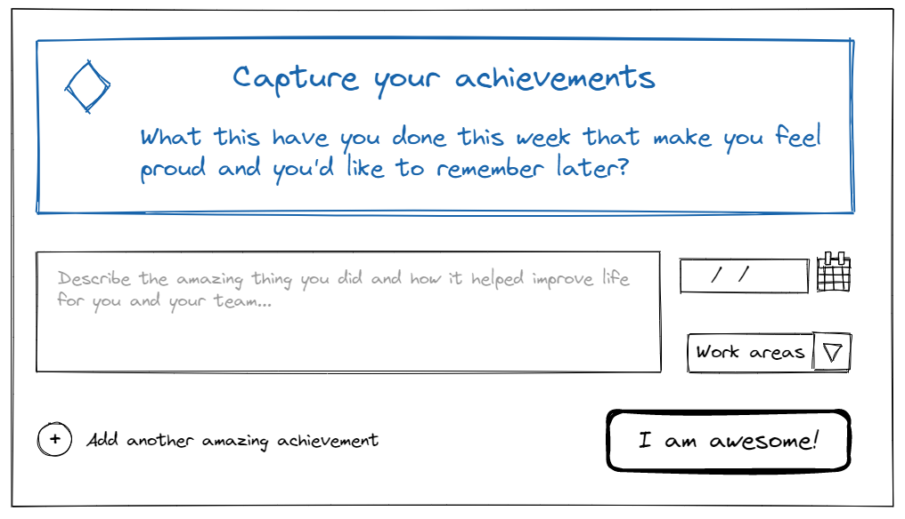
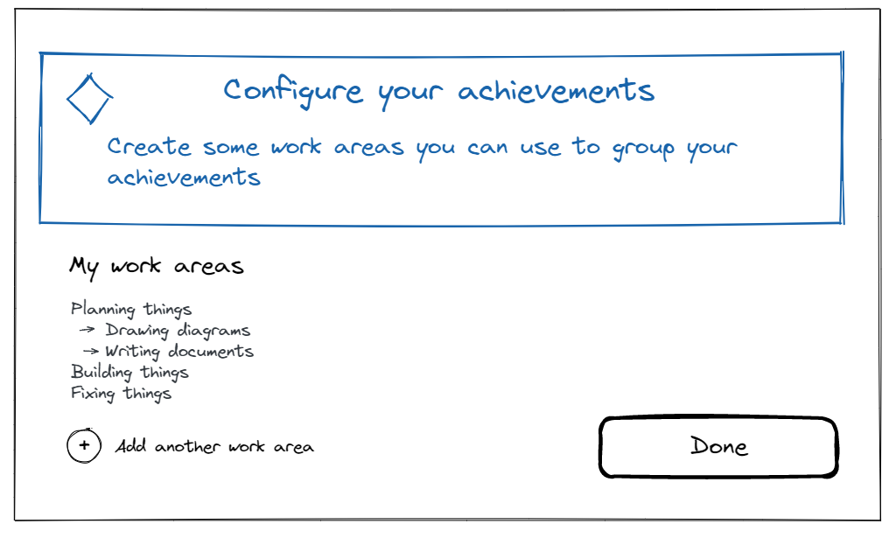

After reading about [documenting success](https://github.com/readme/guides/document-success), and recently completing a series of annual performance reviews, I wrote a proof of concept web application for capturing achievements and assigning them to work areas, such as key result areas (KRAs).

The application was written in Svelte, using the Vanilla CSS framework for simple application styling. Application data is written to localStorage for persistence and loaded next time the user opens the application.

Routing was implemented with pages according to SvelteKit standard implementation.

[github.com/dustykeyboard/achievements](https://github.com/dustykeyboard/achievements)