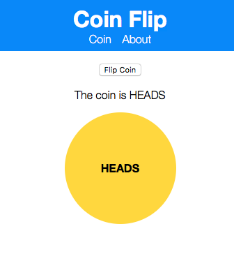

A small Server Side Rendered React app which flips a coin on the server (from an API) and hydrates the application and state on the client.

> [github/dustykeyboard/ssr-coin-flip](https://github.com/dustykeyboard/ssr-coin-flip)
